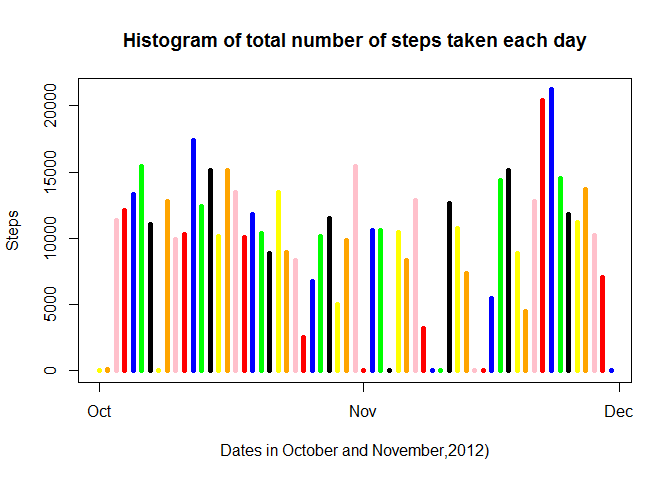
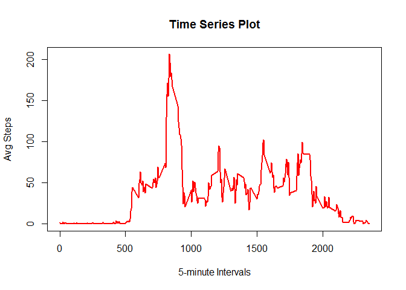
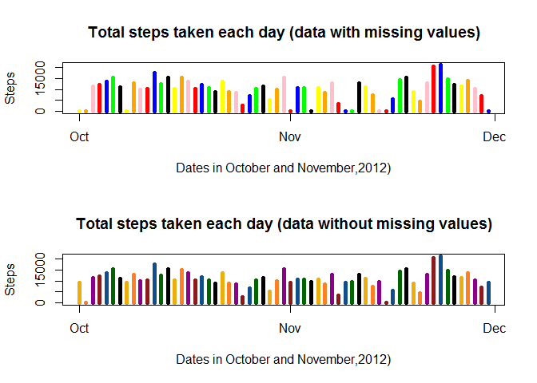
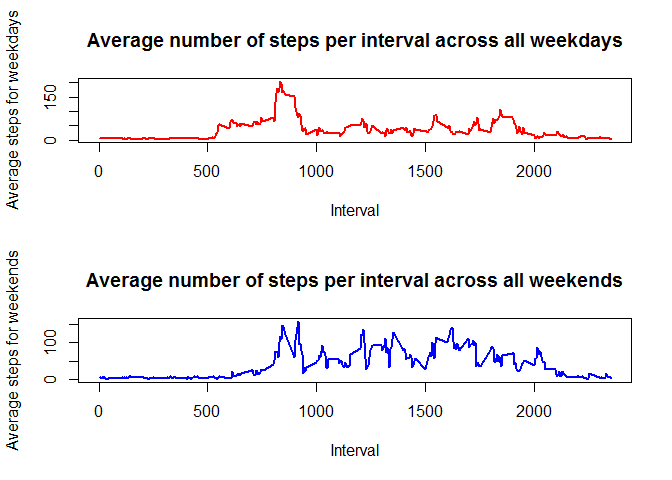

# PA1_template
KB  
Friday, November 13, 2015  
#Data Science : Reproducible Research - Assignment 1

##Introduction
It is now possible to collect a large amount of data about personal movement using activity monitoring devices such as a [Fitbit](http://www.fitbit.com/), [Nike Fuelband](http://www.nike.com/us/en_us/c/nikeplus-fuel), or [Jawbone Up](https://jawbone.com/up). These type of devices are part of the "quantified self" movement - a group of enthusiasts who take measurements about themselves regularly to improve their health, to find patterns in their behavior, or because they are tech geeks. But these data remain under-utilized both because the raw data are hard to obtain and there is a lack of statistical methods and software for processing and interpreting the data.

This assignment makes use of data from a personal activity monitoring device. This device collects data at 5 minute intervals through out the day. The data consists of two months of data from an anonymous individual collected during the months of October and November, 2012 and include the number of steps taken in 5 minute intervals each day.

##Data
The data for this assignment can be downloaded from the course web site:

- Dataset: [Activity monitoring data](https://d396qusza40orc.cloudfront.net/repdata%2Fdata%2FActivity.zip) (52K) 

The variables included in this dataset are:

- **steps**: Number of steps taking in a 5-minute interval (missing values are coded as NA)
- **date**: The date on which the measurement was taken in YYYY-MM-DD format
- **interval**: Identifier for the 5-minute interval in which measurement was taken

The dataset is stored in a comma-separated-value (CSV) file and there are a total of 17,568 observations in this dataset.

##Assignment

The assignment consists of 5 sections

1. Loading and preprocessing the data
2. What is mean total number of steps taken per day?
3. What is the average daily activity pattern?
4. Imputing missing values
5. Are there differences in activity patterns between weekdays and weekends?

###Section 1 : Loading and preprocessing the data

*NOTE:* You must set the Working Directory to point to the folder where you saved the zip file and where you will be running this R Markdown file.

####**1. Load the data**

The link provided a zip file. Proceeding to unzip the file and then load activity.csv file as a dataframe in R.


```r
library(ggplot2)
library('knitr')
unzip(zipfile="repdata-data-activity.zip")
fitdata<-read.csv("./activity.csv")
```

####**2. Process/transform the data (if necessary) into a format suitable for your analysis**

We need to capture the dates (unique dates) from the dataset and transform the date into the POSIXlt class so we can capture the julian date, so we can use it later on.


```r
alldates <- strptime(fitdata$date, "%Y-%m-%d")
fitdata$date <- alldates
unqdates <- unique(alldates)
unqintervals <- unique(fitdata$interval)
```

###Section 2 : What is mean total number of steps taken per day?

####**1. Calculate the total number of steps taken per day**

Calculating the number of steps grouped by julian day


```r
TotStepsPerDay <- split(fitdata$steps, alldates$yday)
SumTotalTotStepsPerDay <- sapply(TotStepsPerDay, sum, na.rm=TRUE)
```

####**2. Make a histogram of the total number of steps taken each day**

Plotting a histogram to show the total number of steps taken each dat from October to November in 2012.
Coloring the histogram with 7 colors to differenciate each week.


```r
#Plotting a histogram
plot(unqdates, SumTotalTotStepsPerDay, main="Histogram of total number of steps taken each day", 
     xlab="Dates in October and November,2012)", ylab="Steps", type="h", lwd=5, 
     col=c("yellow","orange","pink","red","blue","green","black"))
```

 

```r
#dev.copy(png, file="plot1.png", height=480, width=480)
```

**OBSERVATION**, activity jumps up in the last week of November, coincidentaly during the Thanksgiving week.

####**3. Calculate and report the mean and median of the total number of steps taken per day**

Calculating the mean and median of total steps per day and assigning the values to a vector.


```r
#Calculating the meean per julian day
MeanStepsPerDay <- sapply(TotStepsPerDay, mean, na.rm=TRUE)
MeanStepsPerDay
```

```
##        274        275        276        277        278        279 
##        NaN  0.4375000 39.4166667 42.0694444 46.1597222 53.5416667 
##        280        281        282        283        284        285 
## 38.2465278        NaN 44.4826389 34.3750000 35.7777778 60.3541667 
##        286        287        288        289        290        291 
## 43.1458333 52.4236111 35.2048611 52.3750000 46.7083333 34.9166667 
##        292        293        294        295        296        297 
## 41.0729167 36.0937500 30.6284722 46.7361111 30.9652778 29.0104167 
##        298        299        300        301        302        303 
##  8.6527778 23.5347222 35.1354167 39.7847222 17.4236111 34.0937500 
##        304        305        306        307        308        309 
## 53.5208333        NaN 36.8055556 36.7048611        NaN 36.2465278 
##        310        311        312        313        314        315 
## 28.9375000 44.7326389 11.1770833        NaN        NaN 43.7777778 
##        316        317        318        319        320        321 
## 37.3784722 25.4722222        NaN  0.1423611 18.8923611 49.7881944 
##        322        323        324        325        326        327 
## 52.4652778 30.6979167 15.5277778 44.3993056 70.9270833 73.5902778 
##        328        329        330        331        332        333 
## 50.2708333 41.0902778 38.7569444 47.3819444 35.3576389 24.4687500 
##        334 
##        NaN
```

```r
#Calculating the median per julian day
MedianStepsPerDay <- sapply(TotStepsPerDay, median, na.rm=TRUE)
MedianStepsPerDay
```

```
## 274 275 276 277 278 279 280 281 282 283 284 285 286 287 288 289 290 291 
##  NA   0   0   0   0   0   0  NA   0   0   0   0   0   0   0   0   0   0 
## 292 293 294 295 296 297 298 299 300 301 302 303 304 305 306 307 308 309 
##   0   0   0   0   0   0   0   0   0   0   0   0   0  NA   0   0  NA   0 
## 310 311 312 313 314 315 316 317 318 319 320 321 322 323 324 325 326 327 
##   0   0   0  NA  NA   0   0   0  NA   0   0   0   0   0   0   0   0   0 
## 328 329 330 331 332 333 334 
##   0   0   0   0   0   0  NA
```

We can observe the average median value for per day is zero.

###Section 3 : What is the average daily activity pattern?

####**1. Make a time series plot (i.e. type = "l") of the 5-minute interval (x-axis) and the average number of steps taken, averaged across all days (y-axis)**


```r
#Group the number of steps by interval
AvgStepsPerInterval <- split(fitdata$steps, fitdata$interval)
#Calculate the mean of number of steps per interval
AvgStepsPerInterval <- sapply(AvgStepsPerInterval, mean, na.rm=TRUE)
#Plotting the data as a Time Series per interval
plot(unqintervals, AvgStepsPerInterval, type="l", main = "Time Series Plot", xlab="5-minute Intervals", 
     ylab="Avg Steps",col="red", lwd=2)
```

 

```r
#dev.copy(png, file="plot2.png", height=480, width=480)
```
     
####**2. Which 5-minute interval, on average across all the days in the dataset, contains the maximum number of steps?**


```r
#Getting the maximum number of steps per interval
maxStepsPerInterval <- max(AvgStepsPerInterval, na.rm=TRUE)
AvgStepsPerInterval[which.max(AvgStepsPerInterval)]
```

```
##      835 
## 206.1698
```

```r
print(paste0("Interval ", as.numeric(names(which.max(AvgStepsPerInterval)))))
```

```
## [1] "Interval 835"
```

###Section 4 : Imputing missing values

Note that there are a number of days/intervals where there are missing values (coded as NA).
The presence of missing days may introduce bias into some calculations or summaries of the data.

####**1.Calculate and report the total number of missing values in the dataset (i.e. the total number of rows with NAs)**

We will first calculate the number of missing vales in the dataset.


```r
#Variable missingvalues will contain the number of missing values
missingvalues<-sum(is.na(fitdata$steps))
#Printing value of missing values
print(paste0("Total Number of missing values ", missingvalues))
```

```
## [1] "Total Number of missing values 2304"
```

####**2. Devise a strategy for filling in all of the missing values in the dataset. The strategy does not need to be sophisticated. For example, you could use the mean/median for that day, or the mean for that 5-minute interval, etc.**

The strategy we will use to fill in the missing values in the dataset is to replace all NAN values with the median valued as zero as we previously dispayed and replace all NA values with the mean of that particular 5-minute interval where the observation falls on.


```r
#Calculating the number of unique intervals
length(unqintervals)
```

```
## [1] 288
```

```r
print(paste0("Number of intervals per day: ", as.numeric(length(unqintervals))))
```

```
## [1] "Number of intervals per day: 288"
```

```r
#Calculating the total number of days
length(unqdates)
```

```
## [1] 61
```

```r
print(paste0("Number of days: ", as.numeric(length(unqdates))))
```

```
## [1] "Number of days: 61"
```

```r
#There are 288 intervals per day, during 61 days
#Assigning to all intervals with NAN as a median zero
MeanStepsPerDay[is.nan(MeanStepsPerDay)] <- 0
#Create new vector of 288 length to create 288 new values containing means
newmeanvector<- rep(MeanStepsPerDay, 288)
newstepsvector<-fitdata$steps
# We need to find where the NA values are
NAsteps <- is.na(newstepsvector)
#Replacing the values that are NA with the corresponding mean value
newstepsvector[NAsteps]<-newmeanvector[NAsteps]
```

####**3. Create a new dataset that is equal to the original dataset but with the missing data filled in.**


```r
#Creating a new dataset that will store the values from the new steps dataset without NA or NAN values
newfitdata<-fitdata
newfitdata$steps<-newstepsvector
```

####**4. Make a histogram of the total number of steps taken each day and Calculate and report the mean and median  total number of steps taken per day. Do these values differ from the estimates from the first part of the assignment? What is the impact of imputing missing data on the estimates of the total daily number of steps?**

Repeating Section 2 using the new dataset, following same steps to create the histogram


```r
#Splitting the data grouping steps by date
TotStepsPerDayDF2 <- split(newfitdata$steps, alldates$yday)
#Calculates the sum of total steps per day in the new data frame
SumTotalTotStepsPerDayDF2 <- sapply(TotStepsPerDayDF2, sum, na.rm=TRUE)
#Setting the plot to be combined in 2 rows and 1 column
par(mfcol=c(2,1))
# Plotting the original histogram in the first column
plot(unqdates, SumTotalTotStepsPerDay, main="Total steps taken each day (data with missing values)", 
     xlab="Dates in October and November,2012)", ylab="Steps", type="h", lwd=5, 
     col=c("yellow","orange","pink","red","blue","green","black"))
#dev.copy(png, file="plot3.png", height=480, width=480)
# Plotting the new histogram in the second column
plot(unqdates, SumTotalTotStepsPerDayDF2, main="Total steps taken each day (data without missing values)", 
     xlab="Dates in October and November,2012)", ylab="Steps", type="h", lwd=5, 
     col=c("darkgoldenrod2","chocolate1","darkmagenta","firebrick4","dodgerblue4","darkgreen","black"))
```

 

Do these values differ from the estimates from the first part of the assignment?


```r
#Calculating the average number of steps per day using new dataset
MeanStepsPerDayDF2 <- sapply(TotStepsPerDayDF2, mean, na.rm=TRUE)
#Printing MEAN WITH missing values
MeanStepsPerDay
```

```
##        274        275        276        277        278        279 
##  0.0000000  0.4375000 39.4166667 42.0694444 46.1597222 53.5416667 
##        280        281        282        283        284        285 
## 38.2465278  0.0000000 44.4826389 34.3750000 35.7777778 60.3541667 
##        286        287        288        289        290        291 
## 43.1458333 52.4236111 35.2048611 52.3750000 46.7083333 34.9166667 
##        292        293        294        295        296        297 
## 41.0729167 36.0937500 30.6284722 46.7361111 30.9652778 29.0104167 
##        298        299        300        301        302        303 
##  8.6527778 23.5347222 35.1354167 39.7847222 17.4236111 34.0937500 
##        304        305        306        307        308        309 
## 53.5208333  0.0000000 36.8055556 36.7048611  0.0000000 36.2465278 
##        310        311        312        313        314        315 
## 28.9375000 44.7326389 11.1770833  0.0000000  0.0000000 43.7777778 
##        316        317        318        319        320        321 
## 37.3784722 25.4722222  0.0000000  0.1423611 18.8923611 49.7881944 
##        322        323        324        325        326        327 
## 52.4652778 30.6979167 15.5277778 44.3993056 70.9270833 73.5902778 
##        328        329        330        331        332        333 
## 50.2708333 41.0902778 38.7569444 47.3819444 35.3576389 24.4687500 
##        334 
##  0.0000000
```

```r
#Printing MEAN WITHOUT missing values
MeanStepsPerDayDF2
```

```
##        274        275        276        277        278        279 
## 32.3355276  0.4375000 39.4166667 42.0694444 46.1597222 53.5416667 
##        280        281        282        283        284        285 
## 38.2465278 32.2632378 44.4826389 34.3750000 35.7777778 60.3541667 
##        286        287        288        289        290        291 
## 43.1458333 52.4236111 35.2048611 52.3750000 46.7083333 34.9166667 
##        292        293        294        295        296        297 
## 41.0729167 36.0937500 30.6284722 46.7361111 30.9652778 29.0104167 
##        298        299        300        301        302        303 
##  8.6527778 23.5347222 35.1354167 39.7847222 17.4236111 34.0937500 
##        304        305        306        307        308        309 
## 53.5208333 32.0149498 36.8055556 36.7048611 32.4504726 36.2465278 
##        310        311        312        313        314        315 
## 28.9375000 44.7326389 11.1770833 32.3078945 32.8706718 43.7777778 
##        316        317        318        319        320        321 
## 37.3784722 25.4722222 32.9865210  0.1423611 18.8923611 49.7881944 
##        322        323        324        325        326        327 
## 52.4652778 30.6979167 15.5277778 44.3993056 70.9270833 73.5902778 
##        328        329        330        331        332        333 
## 50.2708333 41.0902778 38.7569444 47.3819444 35.3576389 24.4687500 
##        334 
## 32.2280213
```

```r
#Calculating the median number of steps per day using new dataset
MedianStepsPerDayDF2 <- sapply(TotStepsPerDayDF2, median, na.rm=TRUE)
#Printing MEDIAN WITH missing values
MedianStepsPerDay
```

```
## 274 275 276 277 278 279 280 281 282 283 284 285 286 287 288 289 290 291 
##  NA   0   0   0   0   0   0  NA   0   0   0   0   0   0   0   0   0   0 
## 292 293 294 295 296 297 298 299 300 301 302 303 304 305 306 307 308 309 
##   0   0   0   0   0   0   0   0   0   0   0   0   0  NA   0   0  NA   0 
## 310 311 312 313 314 315 316 317 318 319 320 321 322 323 324 325 326 327 
##   0   0   0  NA  NA   0   0   0  NA   0   0   0   0   0   0   0   0   0 
## 328 329 330 331 332 333 334 
##   0   0   0   0   0   0  NA
```

```r
#Printing MEDIAN WITHOUT missing values
MedianStepsPerDayDF2
```

```
##      274      275      276      277      278      279      280      281 
## 36.09375  0.00000  0.00000  0.00000  0.00000  0.00000  0.00000 36.09375 
##      282      283      284      285      286      287      288      289 
##  0.00000  0.00000  0.00000  0.00000  0.00000  0.00000  0.00000  0.00000 
##      290      291      292      293      294      295      296      297 
##  0.00000  0.00000  0.00000  0.00000  0.00000  0.00000  0.00000  0.00000 
##      298      299      300      301      302      303      304      305 
##  0.00000  0.00000  0.00000  0.00000  0.00000  0.00000  0.00000 35.93576 
##      306      307      308      309      310      311      312      313 
##  0.00000  0.00000 36.17014  0.00000  0.00000  0.00000  0.00000 35.93576 
##      314      315      316      317      318      319      320      321 
## 36.09375  0.00000  0.00000  0.00000 36.09375  0.00000  0.00000  0.00000 
##      322      323      324      325      326      327      328      329 
##  0.00000  0.00000  0.00000  0.00000  0.00000  0.00000  0.00000  0.00000 
##      330      331      332      333      334 
##  0.00000  0.00000  0.00000  0.00000 35.93576
```

**What is the impact of imputing missing data on the estimates of the total daily number of steps?**
Looking at the charts, the only values that seem have changed are those days where the observations were missing (NA and NAN or zeros). The rest of the observations look the same.
Adding the mean into those missing values, will not change significantlly specially when calculating the mean.

###Section 5 : Are there differences in activity patterns between weekdays and weekends?

For this part the weekdays() function may be of some help here. Use the dataset with the filled-in missing values for this part.
We will need to create 2 datasets, one for weekdays and one for weekends and split the data from the original dataset.

####**1. Create a new factor variable in the dataset with two levels - "weekday" and "weekend" indicating whether a given date is a weekday or weekend day.**


```r
# wday is an integer ranging from 0 to 6 that represents the day of the week
# 0 is for Sunday, 1 is for Monday, ..  6 for Saturday
allwdays <- alldates$wday
# Createting a numeric vector containing data 1 for a weekday and 2 for a weekend
tablewday <- rep(0, 17568) # in total there are 17568 observations
# Assigning 1 to a weekday
tablewday[allwdays >= 1 & allwdays <= 5] <- 1
# Assigning 2 to a weekend day
tablewday[allwdays == 6 | allwdays == 0] <- 2
# Creating new dataset 
tabledays <- factor(tablewday, levels=c(1,2), labels=c("Weekdays", "Weekends"))
# Create a new column that contains this factor for each day
newfitdata$weekDay <- tabledays
# Splitting up into a week days dataframe and weekend dataframe
tableWeekdays <- newfitdata[newfitdata$weekDay == "Weekdays", ]
tableWeekends <- newfitdata[newfitdata$weekDay == "Weekends", ]
#Grouping number of steps for each week day group by interval
StepsOnWeekdays <- split(tableWeekdays$steps, tableWeekdays$interval)
StepsOnWeekends <- split(tableWeekends$steps, tableWeekends$interval)
# Calculating the average number of steps per interval
meanStepsOnWeekdays <- sapply(StepsOnWeekdays, mean)
meanStepsOnWeekends <- sapply(StepsOnWeekends, mean)
```

####**2. Make a panel plot containing a time series plot (i.e. type = "l") of the 5-minute interval (x-axis) and the average number of steps taken, averaged across all weekday days or weekend days (y-axis).**


```r
#Plotting the data
par(mfcol=c(2,1))
plot(unqintervals, meanStepsOnWeekdays, type="l",
     main="Average number of steps per interval across all weekdays", 
     xlab="Interval", ylab="Average steps for weekdays", 
     lwd=2, col="red")
#dev.copy(png, file="plot4.png", height=480, width=480)
plot(unqintervals, meanStepsOnWeekends, type="l",
     main="Average number of steps per interval across all weekends", 
     xlab="Interval", ylab="Average steps for weekends", 
     lwd=2, col="blue")
```

 

**OBSERVATION :** We can observe the average number of steps increses during the weekends and decreases during weekdays. One cause would be the lack of time for a person to do an activity outside work.


